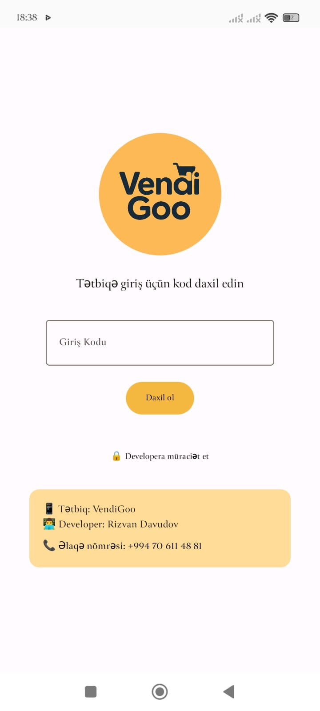
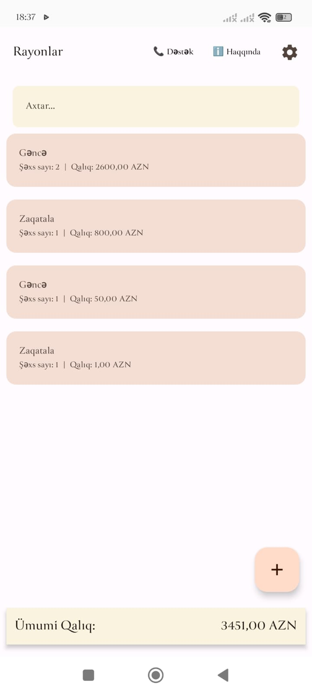
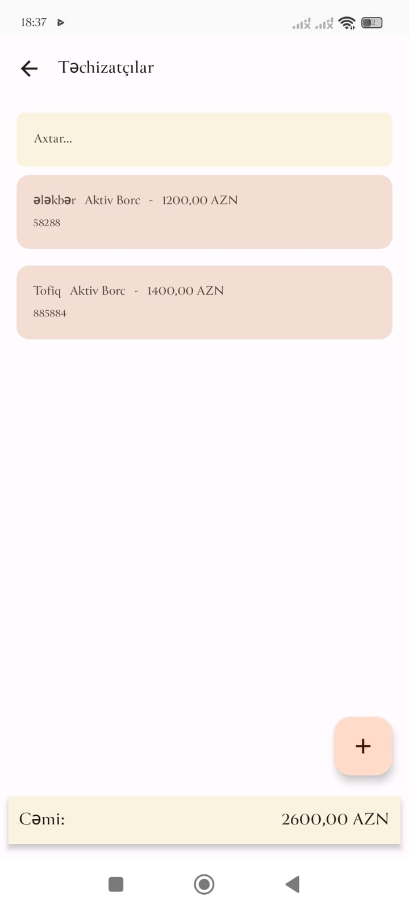
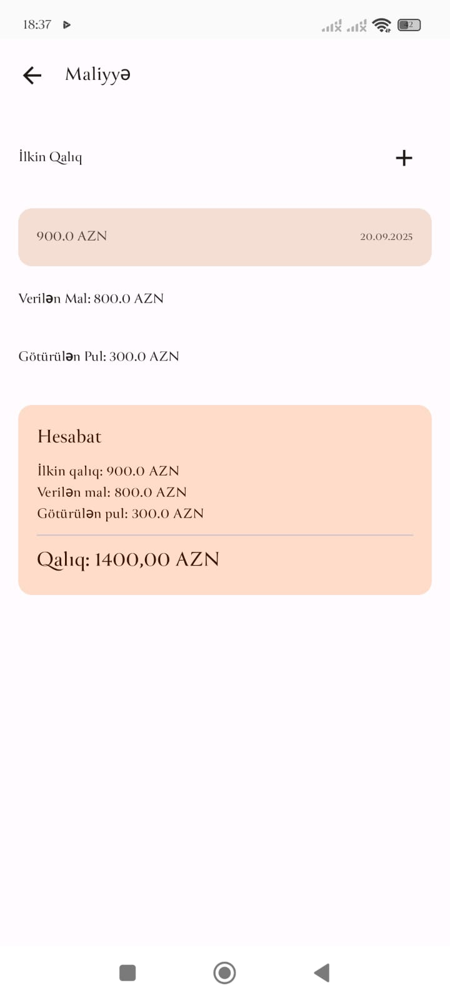
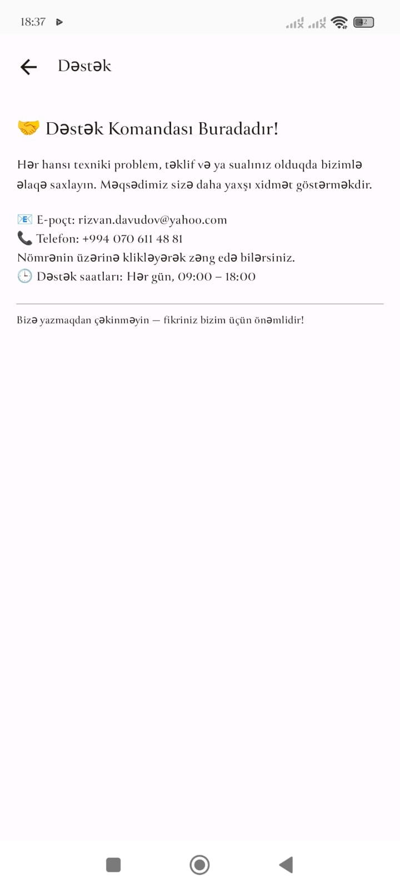

📱 VendiGoo

VendiGoo is a modern mobile app designed to manage sales and supplier debts. It’s built with Kotlin and Jetpack Compose.

🚀 Key Features

Manage districts and suppliers

Record initial balances, goods given, and money taken

Automatic balance calculations

Backup & Restore functionality

Clean, modern, and user-friendly Material3 UI

📂 Project Structure

com.example.vendigoo/
 ├── data/                  # Entities and DAOs
 ├── repository/            # Repository layer
 ├── ui/screens/            # Screens (Main, Suppliers, Finance, etc.)
 ├── viewmodel/             # ViewModels
 └── utils/                 # Helper functions

🖼️ Screenshots

📸 Screenshots

 
  
  
  
  
  
  
 

🛠️ Tech Stack

Kotlin

Jetpack Compose

Room Database

Coroutines + Flow

MVVM Architecture

📦 Installation

git clone https://github.com/your-username/vendigoo.git

Open in Android Studio and hit “Run”.

👤 Author

Rizvan Davudov
